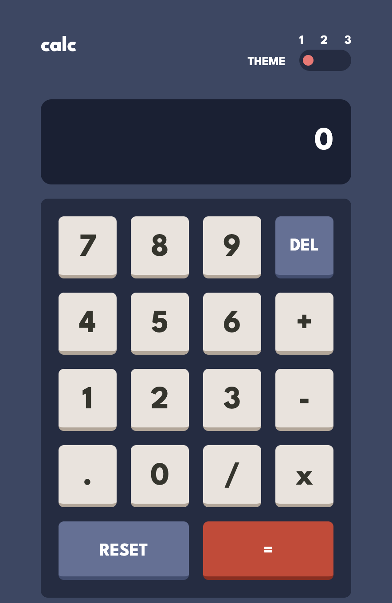
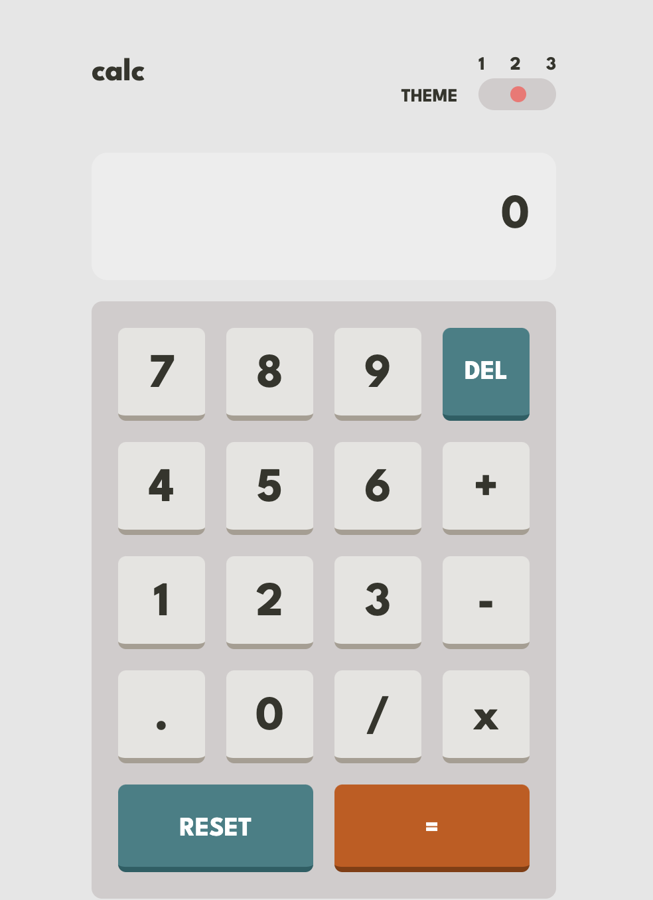
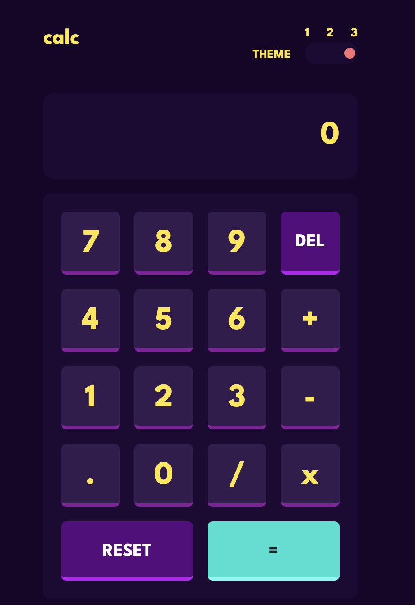

# Frontend Mentor - Calculator app solution

### The challenge

Users should be able to:

- See the size of the elements adjust based on their device's screen size
- Perform mathmatical operations like addition, subtraction, multiplication, and division
- Adjust the color theme based on their preference
- **Bonus**: Have their initial theme preference checked using `prefers-color-scheme` and have any additional changes saved in the browser

### Links
- Live Site URL: [sanderdechering.github.io/Frontend-mentor_calculator-app/](https://sanderdechering.github.io/Frontend-mentor_calculator-app/)

### Built with

- [VueJS](https://vuejs.org/) - Vue JS
- [TailwindCSS](https://tailwindcss.com/) - Tailwind css

### What I learned

The calculator is one that I developed for the first time with Javascript. My first iteration was one that I came up by myself, one that I have not included here, but after struggling I looked up how people usually build these thing. The eval() function was one
that I have never heard of, so using this function here made the calculator app a lot easier to build. Also, adding a toggle button that doesn't toggle between true or false, but between 1,2,3 was something new. 

## Author

- Website - [sanderdechering.nl](https://www.sanderdechering.nl)
- Frontend Mentor - [@sanderdechering](https://www.frontendmentor.io/profile/sanderdechering)